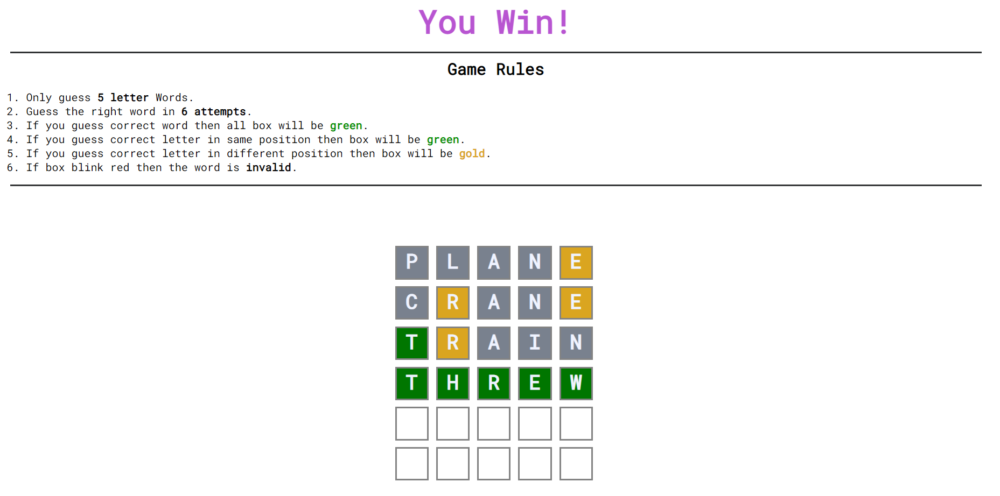

# Word Guess Game

This is a simple word guess game where the player has to guess a 5-letter word. The game is built using HTML, CSS, and JavaScript.

## How to Play

1. Open the index.html file in your web browser.
2. Enter your guess word.
3. Press the Enter key on your keyboard.
4. If your guess is correct, you win the game! Otherwise, you can keep guessing until you run out of guesses.

## Features

1. Randomly generated 5-letter word for each game
2. Limited number of guesses (default: 6)
3. Display of guessed letters and correct letters in the word
4. Win/lose message at the end of the game

## Screenshots

## Installation

1. Clone [this](https://github.com/shubranshugupta/word-game.git) repository to your local machine.
2. Open the index.html file in your web browser.

## Contributing

Contributions are welcome! If you would like to contribute to this project, please fork the repository and submit a pull request.

## Credits

This project was created by `Shubhranshu Gupta`.

## License

This project is licensed under the [MIT License](LICENSE).
